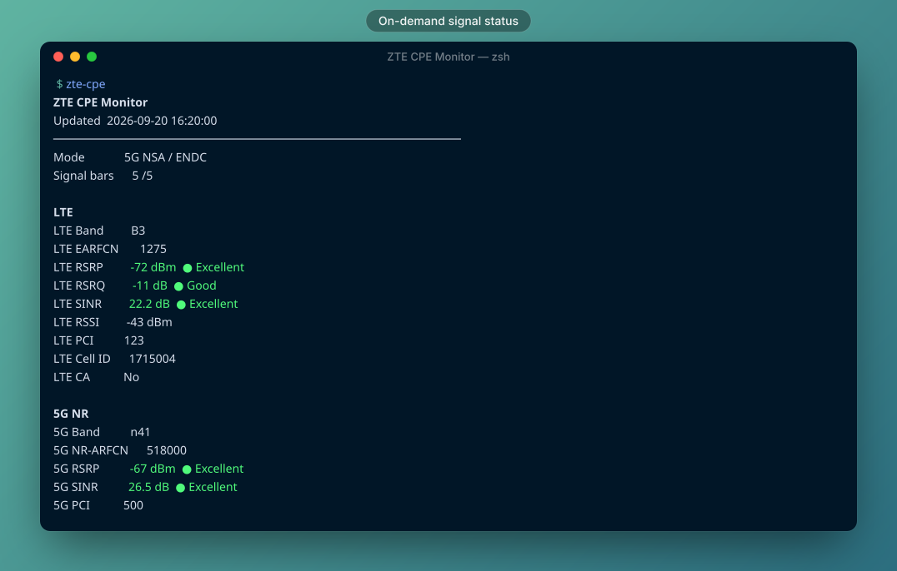
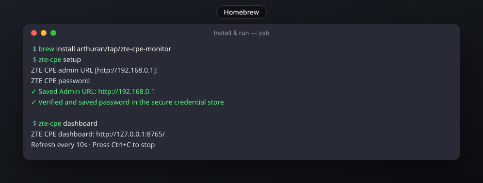

# ZTE CPE Monitor

Unofficial, lightweight, on-demand CLI and temporary local dashboard for monitoring radio status from compatible ZTE CPE devices.

<p align="center">
  
</p>

## Why

ZTE CPE Monitor reads the same local Web UI status data that compatible ZTE devices expose to an authenticated administrator. It is designed for people who want signal details without repeatedly opening the router Web UI.

- on-demand: no daemon or background service
- CLI output with quality indicators
- optional explanations for radio metrics
- temporary browser dashboard bound to `127.0.0.1` by default
- English and Thai UI
- secure password storage where the platform provides it
- JSON output for scripts
- model/API detection
- no third-party Python packages

## Install

### Homebrew

Once the tap is available:

```sh
brew install arthuran/tap/zte-cpe-monitor
```

<p align="center">
  
</p>

### Direct

Requires Python 3.9 or newer.

```sh
python3 zte_cpe.py --help
```

## First run

```sh
zte-cpe
```

The first run asks for the device admin URL and password. The URL is saved in the application config. On macOS the password is stored in Keychain. On Linux, Secret Service is used when `secret-tool` is available; otherwise the password is not persisted.

## Usage

```sh
zte-cpe                  # current status in the terminal
zte-cpe -e               # status plus metric explanations
zte-cpe dashboard        # temporary local dashboard
zte-cpe --json           # machine-readable output
zte-cpe detect           # model, firmware and API adapter
zte-cpe capabilities     # read-only capability probe
zte-cpe telemetry        # connection + traffic counters
zte-cpe support-bundle   # privacy-safe diagnostic JSON
zte-cpe config           # current non-secret config
zte-cpe url              # change admin URL
zte-cpe password         # change stored password
zte-cpe language en      # English
zte-cpe language th      # Thai
zte-cpe --version
```

The dashboard runs only while the command is active. Press `Ctrl+C` to stop it.

## Diagnostics and capability discovery

`zte-cpe capabilities` probes only a curated set of read-only fields and reports whether each capability is available, present-but-empty, or unavailable. It also probes client-summary counters when the firmware exposes them, without collecting client MAC/IP/hostname data. This helps distinguish an inactive feature such as Carrier Aggregation from a firmware that does not expose the field at all.

`zte-cpe telemetry` shows connection state, session duration, realtime TX/RX counters and rates, and monthly usage when the firmware exposes those fields. It intentionally does not request WAN IP, APN, SSID, hostname, MAC address, IMEI, or IMSI.

`zte-cpe support-bundle` writes a diagnostic JSON file for compatibility reports. The bundle contains device family/version metadata, adapter identity, field names and capability states, but no passwords, cookies, IP/MAC addresses, cell IDs, SSIDs, hostnames, or raw radio values.

```sh
zte-cpe support-bundle --output ~/Desktop/zte-cpe-support.json
```

## Signal indicators

Color ratings are provided for the metrics that are most useful for a quick radio-quality check:

| Metric | What it means |
| --- | --- |
| RSRP | Reference-signal power; closer to 0 dBm is stronger |
| RSRQ | LTE reference-signal quality; affected by interference/load |
| SINR | Signal-to-interference-plus-noise ratio; higher is better |

Thresholds are intentionally practical rather than carrier-specific guarantees.

## Compatibility

The code is adapter-based. Version `0.1.0` ships with the `legacy-goform-ld` adapter, which uses the local `/goform/` API and LD challenge-response authentication.

| Device / family | Status | Notes |
| --- | --- | --- |
| ZTE MC7010 | Tested | Verified with the legacy goform/LD API |
| Other ZTE models using the same API family | Experimental | May work if field names/auth flow match |
| Models requiring RD/AD or username auth | Not yet supported | Planned as separate adapters |
| Newer G5 API family | Not supported yet | Requires a different adapter |

Run `zte-cpe detect` to see what the current adapter detects.

## Platform support

| Platform | Core CLI/dashboard | Secure password persistence |
| --- | --- | --- |
| macOS | Yes | Keychain (`security`) |
| Linux desktop | Yes | Secret Service (`secret-tool`) when available |
| Linux headless | Yes | Depends on Secret Service availability |
| Windows | Not yet qualified | Credential backend not implemented yet |

The application itself only uses the Python standard library.

## Privacy and security

- communicates with the local admin URL you configure
- does not require a ZTE cloud account
- does not bypass authentication
- does not include firmware, Web UI source, passwords, cookies, or device-specific identifiers
- dashboard is intentionally restricted to `127.0.0.1` only
- screenshots in this repository use synthetic/sanitized values

## Security

ZTE CPE Monitor handles router administration credentials, so its security model is deliberately conservative:

- the dashboard listens on `127.0.0.1` only and cannot be bound directly to a LAN/WAN interface
- passwords are not written to the application config
- macOS stores the password in Keychain; Linux uses Secret Service when available
- the macOS Keychain write path avoids placing the password in process arguments
- the tool authenticates normally and does not bypass the device login
- the configured admin URL may use HTTP because many CPE firmwares only expose HTTP locally; use the tool only on a trusted local network or trusted tunnel
- no CPE status data is sent to a cloud service by this project

For remote viewing, prefer an SSH or trusted VPN/Tailscale tunnel to the local dashboard instead of exposing the dashboard port directly.

See [SECURITY.md](SECURITY.md) for vulnerability reporting and supported-version information.

## Disclaimer

This is an unofficial third-party project and is not affiliated with or endorsed by ZTE Corporation. ZTE and related product names are trademarks of their respective owners.

Use it only with devices you own or are authorized to administer. Firmware behavior varies between device models, carriers and regions.

## Development

```sh
python3 -m py_compile zte_cpe.py
python3 -m unittest discover -s tests -v
```

Documentation screenshots are rendered locally with [Codeshot](https://github.com/securekomodo/codeshot):

```sh
brew install securekomodo/tap/codeshot
codeshot --preset terminal docs/cli-sample.txt -o docs/cli.svg
```

## License

MIT
